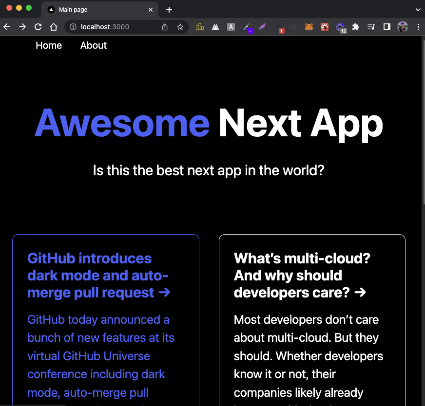

# Awesome Next.js App

This is a practice project to learn Next.js and React.

What I learned:

- Getting Setup with create-next-app
- Pages & Routing
- Head
- Layouts & CSS Modules
- Nav Component & Link
- How to create a Header
- Styled JSX
- Data Fetching
- getStaticProps()
- Showing Data
- Nested Routing
- getServerSideProps()
- getStaticPaths()
- Export a Static Website
- API Routes
- Using the API Data
- Custom Meta Component
- Next.js basics
- React basics

## Demo

